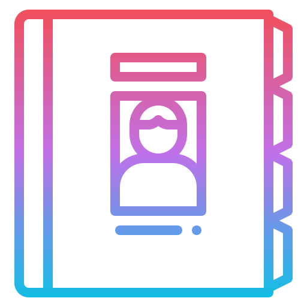

<!-- Logo -->

  

    Icon made by
    <a href="https://www.flaticon.com/authors/iconixar" title="iconixar">iconixar</a>
    from
    <a href="https://www.flaticon.com/" title="Flaticon">www.flaticon.com</a>

<!-- Name -->
<h1 align="center" style="margin-top:10px">Contacts</h1>

<!-- Badges -->

## Next Steps

Check out the [roadmap](./ROADMAP.md)
